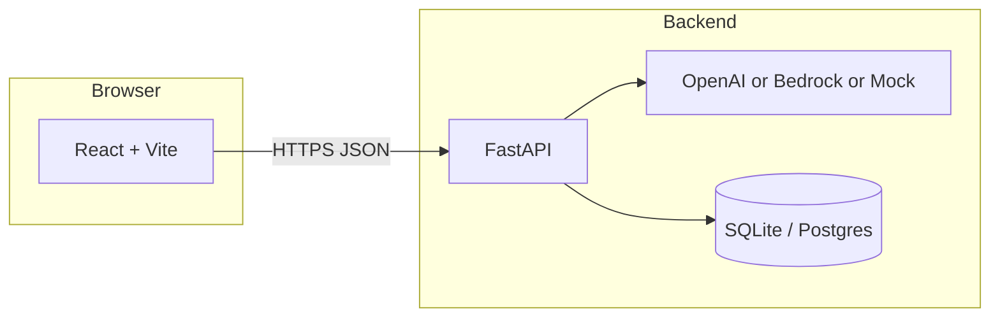

# Smart GTM Agent

A full-stack application that turns **product, audience, budget, region, and competitors** into a structured **go-to-market (GTM) strategy**. The backend uses an LLM to produce JSON (segments, channels, pricing, competitor insights, predicted ROI), stores plans in a database, and serves a React UI for generation, history, charts, and export.

---

## What it does

- **Generate GTM plans** from a short form (product name, target audience, budget, region, competitors).
- **Persist plans** so you can review history and compare runs (SQLAlchemy + SQLite locally, PostgreSQL in AWS).
- **Visualize** key metrics (e.g. Recharts) and **export** content (e.g. PDF via html2canvas + jsPDF).
- **Configure the API key** in the UI for local dev (`/api-key`); in production, keys come from environment or **AWS Secrets Manager**.

---

## How it works (end-to-end)



1. The **frontend** sends `POST /generate-plan` with your inputs.
2. The **backend** either:
   - calls **OpenAI** (`gpt-3.5-turbo`) with a strict JSON-shaped prompt, or
   - calls **Amazon Bedrock** (Claude) when `LLM_PROVIDER=bedrock`, or
   - returns a **deterministic mock strategy** when `MOCK_MODE=1` (no external LLM).
3. The response is parsed as JSON, optionally stored as a **GTM plan** row, and returned to the UI for display and export.

---

## Tech stack and why we chose it

| Layer | Technology | Why |
|--------|------------|-----|
| **API** | [FastAPI](https://fastapi.tiangolo.com/) | Async-friendly, automatic OpenAPI docs, Pydantic validation, good fit for JSON LLM payloads. |
| **Server** | [Uvicorn](https://www.uvicorn.org/) | Standard ASGI server for FastAPI in dev and production containers. |
| **Data model** | [Pydantic](https://docs.pydantic.dev/) + [SQLAlchemy](https://www.sqlalchemy.org/) | Validated request/response shapes; ORM for plans without hand-written SQL everywhere. |
| **Local DB** | SQLite (`sqlite:///./smart_gtm.db`) | Zero setup for development; file-based, no separate DB process. |
| **Cloud DB** | PostgreSQL on **RDS** | Durable, shared state across container restarts; matches SQLAlchemy’s relational model (see architecture doc). |
| **LLM (cloud API)** | [OpenAI Python SDK](https://github.com/openai/openai-python) | Fast iteration, strong chat models, simple key-based auth for prototypes. |
| **LLM (AWS-native)** | [Boto3 Bedrock](https://boto3.amazonaws.com/v1/documentation/api/latest/reference/services/bedrock-runtime.html) | No API key in env when running on ECS with IAM task role; data stays in AWS if required. |
| **Frontend** | [React 18](https://react.dev/) | Component model, large ecosystem; team familiarity. |
| **Build / dev** | [Vite](https://vitejs.dev/) | Fast HMR and production builds; simple env injection (`VITE_API_URL`). |
| **Styling** | [Tailwind CSS](https://tailwindcss.com/) | Utility-first UI without a heavy component framework. |
| **HTTP client** | [Axios](https://axios-http.com/) | Familiar API, interceptors, browser + Node. |
| **Client state** | [Zustand](https://github.com/pmndrs/zustand) | Minimal global state without Redux boilerplate. |
| **Routing** | [React Router](https://reactrouter.com/) | Multi-page flow (home, dashboard, settings). |
| **Charts** | [Recharts](https://recharts.org/) | React-friendly charts for ROI / channel views. |
| **PDF export** | [html2canvas](https://html2canvas.hertzen.com/) + [jsPDF](https://github.com/parallax/jsPDF) | Snapshot DOM and build a downloadable PDF in the browser. |
| **Containers** | Docker + **ECR** | Same image locally and on **ECS Fargate**; registry integrated with AWS deploys. |
| **Orchestration** | **ECS Fargate** | Long-running API with DB connections and LLM latency—better fit than Lambda for this app (see `docs/CLOUD_ARCHITECTURE_EXPLAINED.md`). |
| **Ingress** | **ALB** | Stable HTTP endpoint for ECS tasks whose IPs change on redeploy. |
| **Static frontend** | **S3 + CloudFront** | Cheap, scalable static hosting with CDN; separate from API origin. |
| **Secrets** | **AWS Secrets Manager** | OpenAI key and DB URL not baked into images; injected at task runtime. |
| **IaC** | [Terraform](https://www.terraform.io/) | Repeatable VPC, RDS, ECS, ALB, S3, CloudFront, IAM in one place. |
| **CI/CD** | GitHub Actions | Build/push backend image and sync frontend to S3 on push (see `.github/workflows/`). |

---

## LLM modes

| Mode | Configuration | Use when |
|------|----------------|----------|
| **OpenAI** | `LLM_PROVIDER=openai` + `OPENAI_API_KEY` | Default; you have billing/quota on OpenAI. |
| **Bedrock** | `LLM_PROVIDER=bedrock` + IAM `bedrock:InvokeModel` | You want AWS-only credentials and Claude on Bedrock ([docs/BEDROCK.md](docs/BEDROCK.md)). |
| **Mock** | `MOCK_MODE=1` (Terraform: `backend_mock_mode = true`) | Demos, tests, or when API quota/billing is blocked. |

---

## Quick start (local)

### Backend

```bash
cd backend
python -m venv .venv
source .venv/bin/activate   # Windows: .venv\Scripts\activate
pip install -r requirements.txt
cp .env.example .env        # edit .env — set OPENAI_API_KEY (and optional MOCK_MODE=1)
uvicorn main:app --reload --port 8000
```

### Frontend

```bash
cd frontend
npm install
# Required: API base URL (no trailing slash). Example for local backend:
export VITE_API_URL=http://localhost:8000
# Or create frontend/.env.local with: VITE_API_URL=http://localhost:8000
npm run dev
```

Open the app (typically `http://localhost:5173`). API docs: `http://localhost:8000/docs`.

**Note:** The `/api-key` endpoint writes to local `.env` for convenience—**do not** rely on this in production; use env vars or Secrets Manager.

---

## Cloud deployment

| Topic | Document |
|--------|----------|
| Terraform, ECS, RDS, S3, CloudFront, secrets | [docs/TERRAFORM_AWS_CICD.md](docs/TERRAFORM_AWS_CICD.md) |
| Why each AWS piece exists (vs Lambda, DynamoDB, etc.) | [docs/CLOUD_ARCHITECTURE_EXPLAINED.md](docs/CLOUD_ARCHITECTURE_EXPLAINED.md) |
| Vercel / Railway / Render-style deploys | [docs/CLOUD_SETUP.md](docs/CLOUD_SETUP.md) |
| Bedrock setup and model access | [docs/BEDROCK.md](docs/BEDROCK.md) |

---

## Project layout (high level)

```
SMART-GTM-AGENT/
├── backend/           # FastAPI app, Dockerfile, SQLAlchemy models
├── frontend/          # Vite + React (source; run build for production assets)
├── terraform/         # AWS infrastructure modules and root stack
├── docs/              # Architecture and deployment guides
└── .github/workflows/ # CI: deploy, Terraform checks
```

---

## Security reminders

- **Never commit** `.env`, real API keys, or `terraform.tfvars` with secrets (they are gitignored by design).
- **Rotate** any key that was ever committed or pasted into a chat log.
- Enable **GitHub push protection** and pre-commit secret scanning where possible.

---

## License / contributing

Add your license and contribution guidelines here if the repo is public or team-shared.
